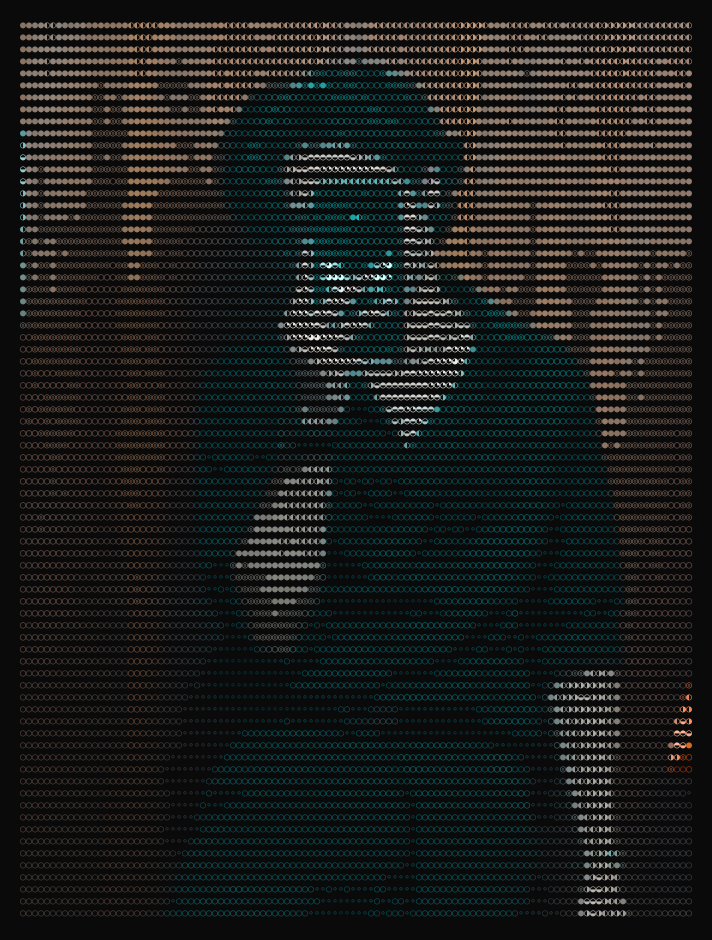

<code>Ishaan Chopra</code>
  

<!-- Animated Typing Effect -->

  

<!-- Side-by-side Profile Art and Stats -->
<table>
<tr>
<td align="center" width="50%">

</td>
<td align="center" width="50%">

 

</td>
</tr>
</table>

  
<!-- Genuine Developer Bio -->
<code>> ./whoami.sh</code>
  
<code>🎓 Education: BCA Data Science @ Lovely Professional University (Class of '29)</code>
 
<code>🚀 Latest Milestone: Competed in the CODE FLUX 36-Hour Hackathon</code>
 
<code>💻 Hardware: MSI Katana 15 (RTX 4000 Series)</code>

  
<!-- Dynamic Activity Line Graph -->
<code>> ./commit_activity.sh</code>
  

  
<!-- Genuine Projects Directory -->
<code>> tree ./Latest_Projects/</code>
  
<code>├── 📊 Student-Performance-Analyzer (Streamlit, Python, MySQL)</code>
 
<code>└── 🗺️ LPU-Copilot (Campus Guide Web App)</code>

  
<!-- Tech Stack Badges -->
<code>> cat skills.txt</code>
  

  
<!-- Contact Me Section -->
<code>> ./connect.sh</code>
  

