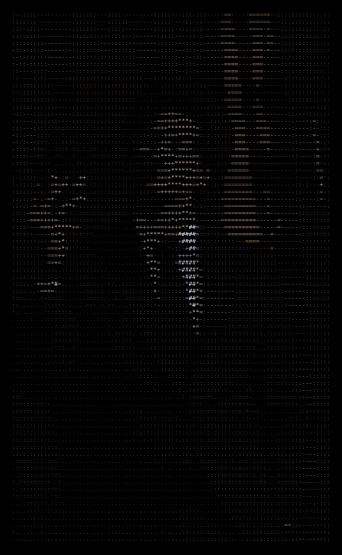

<code>Ishaan Chopra</code>
  

<!-- Animated Typing Effect -->

  

<table>
<tr>
<td align="center" width="50%">

</td>
<td align="center" width="50%">

 

</td>
</tr>
</table>

 
<!-- Tech Stack Badges -->
<code>Tech Stack</code>
  

